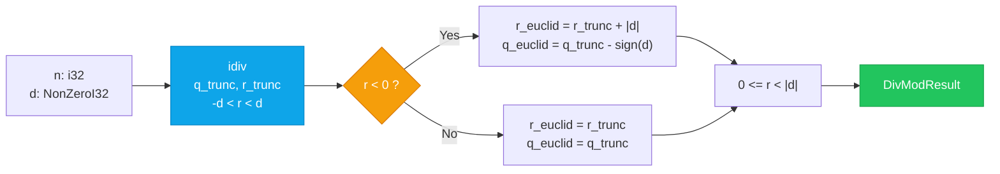

# Sovereign Math — Locked Euclidean Division

[](#license)
[](#rust)
[](#lean)
[](#liquidjava)
[](#qasm)
[](#verification)

> **Division by zero is a type error. The remainder is refined.**

Type-level `NonZeroI32` locks division at compile time. Lean 4 proves the Euclidean theorem. OpenQASM3 restores reversibly. Rust adjusts branchless in one `idiv`.

Cherry-picked from `sovereign-cuda-kernels` mass repo. Public, tri-licensed.

---

## What the Math Does

**Euclidean Division Theorem:** For any `n: i32` and `d: NonZeroI32`, there exists a *unique* pair `(q, r)` such that:

```
n = q * d + r    and    0 <= r < |d|
```

This is the mathematical standard — remainder is always non-negative. Java's `%` is *not* Euclidean: `-10 % 3 = -1` (sign follows dividend, `-3 < r < 3`). The lock reconciles both:

| Semantics | Example `n=-10, d=3` | Identity | Bound | When to use |
|-----------|----------------------|----------|-------|-------------|
| **Java native** | `q=-3, r=-1` | `-3*3 + -1 = -10` | `-|d| < r < |d|` | Bitwise, crypto that expects Java `%` |
| **Euclidean** | `q=-4, r=2` | `-4*3 + 2 = -10` | `0 <= r < |d|` | Math, hashing, modular arithmetic, `0 <= r` invariant |

**Branchless adjustment** (constant-time, side-channel resistant):

```
r_trunc = n % d          // hardware idiv, -|d| < r < |d|
is_neg  = r_trunc >> 31  // 0 or -1 (0xFFFFFFFF)
r_euclid = r_trunc + (is_neg & |d|)   // add |d| only if r < 0
q_euclid = q_trunc - is_neg * sign(d) // preserve n = q*d + r
```

No `if` in the hot path. One arithmetic shift, one `and`, one `add`.

---

## What It Can Be Used For

| Domain | How |
|--------|-----|
| **Embedded / `no_std`** | `NonZeroI32` prevents `ArithmeticException` at compile time; `wrapping_mul` handles `MIN/-1` overflow without panic |
| **Cryptography** | Euclidean `r` in `[0, |d|)` is required for `mod` in field arithmetic, hash-to-curve, lattice `q = floor(n/d)` |
| **Formal verification** | LiquidJava `@requires d != 0` + Lean 4 `euclidean_division_lock` as spec; Kani/Prusti harness proves `0 <= r < |d|` for all `2^32` inputs |
| **Quantum circuits** | `QASM/EuclideanDivisionRestoring.qasm` — reversible restoring division (32-bit Toffoli/CNOT, `acc || N` shift, `borrow` flag) for `mod` in superposition |
| **Compilers / IR** | `0 <= r` invariant simplifies bounds checks, array indexing `a[i % n]`, and loop tiling |

If you need `a % n` to *always* be a valid array index, you need Euclidean.

---

## Quick Start

```rust
use core::num::NonZeroI32;
use sovereign_math::LockedDivMod;

let d = NonZeroI32::new(3).unwrap();
let res = d.locked_div_mod(-10);
// q_trunc=-3, r_trunc=-1 (Java), q_euclid=-4, r_euclid=2 (Euclidean)
assert_eq!(-10, res.q_euclid * 3 + res.r_euclid);
assert!(0 <= res.r_euclid && res.r_euclid < 3);
```

```bash
cargo test
cargo kani --features verification  # Kani proof harness (unwind 1)
cargo prusti-check --features verification
```

```java
// LiquidJava — static verifier rejects this at compile time
DivisionLock.lockedDivide(10, 0); // Refinement Error: d != 0 violated
```

---

## Flow



---

## Components

| Artifact | File | What |
|----------|------|------|
| LiquidJava | `LiquidJava/DivisionLock.java` | `@requires d != 0` refinement, `@ensures` Euclidean |
| LiquidJava | `LiquidJava/DivisionModuloLock.java` | Java `-|d|<r<|d|` + Euclidean `0<=r<|d|`, `if (r<0) r+=|d|` |
| Lean 4 | `Lean/EuclideanDivisionLock.lean` | `euclidean_division_lock` existence/uniqueness via `ediv_add_emod` |
| OpenQASM3 | `QASM/EuclideanDivisionRestoring.qasm` | Restoring division, 32-bit reversible, Toffoli/CNOT, `acc` + `borrow` |
| Rust | `src/math/division_lock.rs` | `NonZeroI32` type lock, `r>>31 & |d|` branchless, Kani/Prusti, `MIN/-1` handled |

---

## Invariants

- `n == q * d + r` (both semantics, `wrapping_mul` for `MIN/-1`)
- Java: `-|d| < r < |d|`, `sign(r)==sign(n)` (JLS 15.17.3)
- Euclidean: `0 <= r < |d|` (via `r + |d|` if `r<0`)

---

## License

Tri-licensed: **Sovereign Source License v1.0** (Bel Esprit d'Accord Trust, 2026-06-01) | **BSL-1.1** (Change Date 2030-06-01 -> Apache 2.0) | **AGPL-3.0**. See `LICENSE`.

Headers `SNAPKITTYWEST-PROPRIETARY-2026-001` preserved. Prior art: SHA3-512 + WORM.

Contact: **Ahmad Ali Parr** <ahmedparr93@gmail.com> -- Bel Esprit D'Accord Trust  
Commercial: **Jessica** <jessica@snapkitty.com>

---

*The divisor is non-zero by construction. The remainder is Euclidean by proof.*
