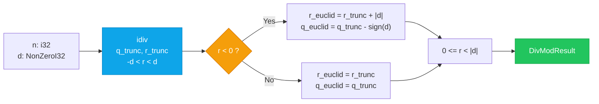

# Sovereign Math — Locked Euclidean Division

[](#license)
[](#rust)
[](#lean)

> **Division by zero is a type error. The remainder is refined.**

Type-level `NonZeroI32` locks division. Lean 4 proves existence/uniqueness. OpenQASM3 restores. Rust branchless adjusts.

## Quick Start

```rust
use core::num::NonZeroI32;
use sovereign_math::LockedDivMod;

let d = NonZeroI32::new(3).unwrap();
let res = d.locked_div_mod(-10);
// q_trunc=-3, r_trunc=-1 (Java), q_euclid=-4, r_euclid=2 (Euclidean)
assert_eq!(-10, res.q_euclid * 3 + res.r_euclid);
assert!(0 <= res.r_euclid && res.r_euclid < 3);
```

```bash
cargo test
cargo kani --features verification  # Kani proof harness
cargo prusti-check --features verification
```

## Flow



## Components

| Artifact | File | What |
|----------|------|------|
| LiquidJava | `LiquidJava/DivisionLock.java` | `@requires d != 0` refinement, `@ensures` Euclidean |
| Lean 4 | `Lean/EuclideanDivisionLock.lean` | `euclidean_division_lock` existence/uniqueness, `java_adjust` |
| OpenQASM3 | `QASM/EuclideanDivisionRestoring.qasm` | Restoring division, 32-bit reversible, Toffoli/CNOT |
| Rust | `src/math/division_lock.rs` | `NonZeroI32`, branchless `r>>31 & |d|`, Kani/Prusti |

## Invariants

- `n == q * d + r`
- Java: `-|d| < r < |d|`, `sign(r)==sign(n)`
- Euclidean: `0 <= r < |d|` (via `r + |d|` if `r<0`)

## License

MIT OR Apache-2.0. See `LICENSE`.

Contact: Ahmad Ali Parr <ahmad@sovereign.local>

---

*The divisor is non-zero by construction. The remainder is Euclidean by proof.*
